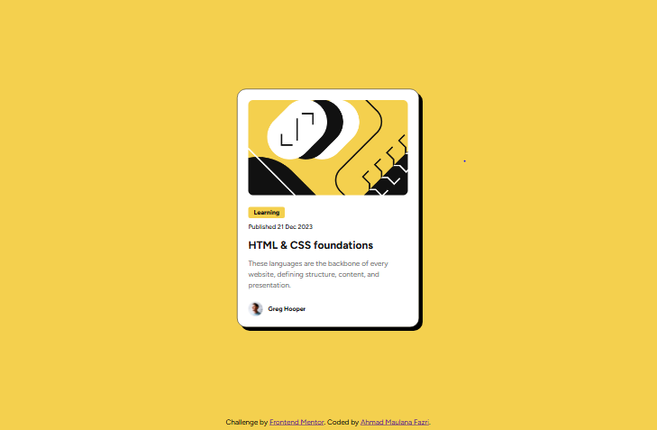

# Frontend Mentor - Blog preview card solution

This is a solution to the [Blog preview card challenge on Frontend Mentor](https://www.frontendmentor.io/challenges/blog-preview-card-ckPaj01IcS). Frontend Mentor challenges help you improve your coding skills by building realistic projects.

## Table of contents

- [Overview](#overview)
  - [Screenshot](#screenshot)
  - [Links](#links)
- [My process](#my-process)
  - [Built with](#built-with)
  - [What I learned](#what-i-learned)
  - [Continued development](#continued-development)
- [Author](#author)
- [Acknowledgments](#acknowledgments)

## Overview

### Screenshot

### Links

- Solution URL: [Add solution URL here](https://github.com/AMfazri/frontend-blog-preview-card.git)
- Live Site URL: [Add live site URL here](https://amfazri.github.io/frontend-blog-preview-card/)

## My process

### Built with

- Semantic HTML5 markup
- Flexbox
- React js

### What I learned

- I learned how to use React js for this Project

- I learned how to make the position of footer which is in the edge of bottom without changes the card position

- Fix blank github page, which is caused by base path in react not defined yet

### Continued development

in next challange, i want to keep use semantic html5 markup and React. i hope using these methods regularly that will make me feel comfort and be a good habitual.

## Author

- Frontend Mentor - [@AMfazri](https://www.frontendmentor.io/profile/AMfazri)

## Acknowledgments

thanks to Chat gpt for being my mentor.i never ask for codes but i ask many alot basic knowledge and ask why some errors happened and how to solve them.
